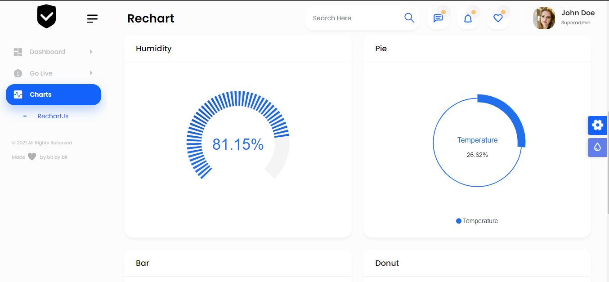
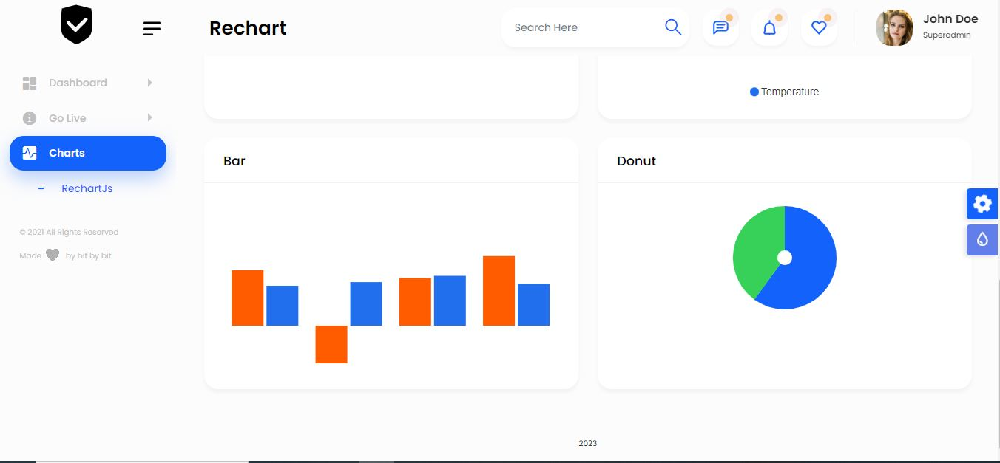
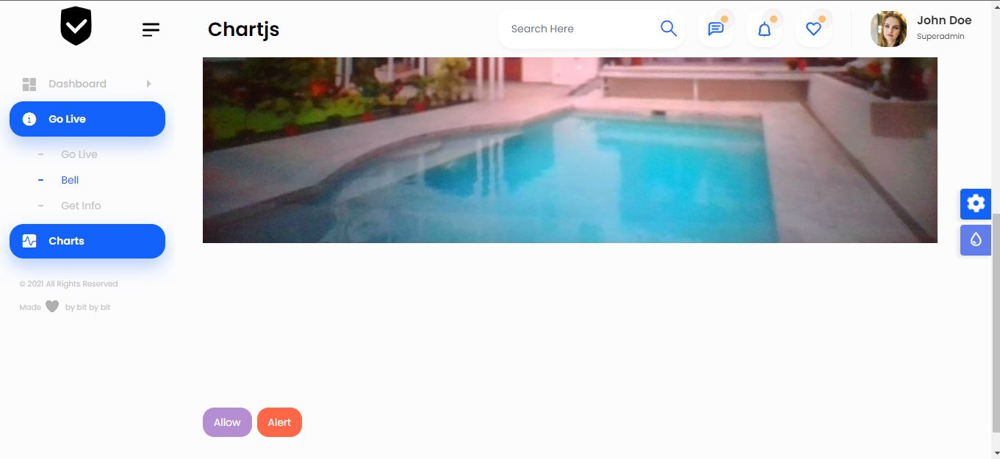
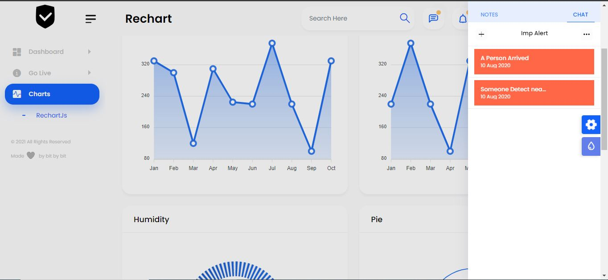

<p align="center">
  
</p>

<p align="center">
  An easy-to-use framework designed to enable efficient implementation of an Intrusion/Theft Detection System using <b> IoT and AI</b>.
  <br />
  <br />
  <a href="#table-of-content"><b>Explore the docs »</b></a>
  <br />
  <br />
  <a href="#description">Description</a>
  &nbsp;&nbsp;·&nbsp;&nbsp;
  <a href="#features">Features</a>
  &nbsp;&nbsp;·&nbsp;&nbsp;
  <a href="#contributing">Local Setup</a>
  <br />
</p>

<br />
<br />

<p align="center">
  
</p>

<br />

### Table Of Content
- [Description](#description)
- [Stack Overview](#stack-overview)
- [Features](#features)
- [Images](#images)
- [Technologies Used](#technologies-used)
- [Local Setup & Contributing](#contributing)
- [License](#license-)


## Description
This is an intrusion/theft detection system that utilizes the Internet of Things (IoT) and Artificial Intelligence (AI) technologies to provide high-level security and peace of mind for property owners and managers. The system involves the use of various sensors and devices to detect and alert for possible unauthorized entry or theft in a given area or property. Using IoT and AI can provide a proactive approach to security by leveraging the power of advanced technology to detect and prevent threats before they become serious.

## Stack Overview
- Raspberry Pi for processing and interfacing with sensors/devices
- AWS IoT Core for device communication and management
- AWS Lambda for serverless computing and ML-based detection
- Amazon S3 for data storage
- Amazon DynamoDB for data management
- Amazon CloudWatch for real-time monitoring and alerts
- Twilio for sending SMS alerts to authorities
- Python Flask for the server
- React for the frontend
- Node and Express for Backend

## Features
- Utilizes IoT and AI technologies for enhanced security
- Raises an alarm/alert in case of an intrusion
- Gathers data from various sensors/devices such as cameras, motion sensors, etc.
- Uses ML-based detection to reduce the number of false positive alarms/thefts
- Provides a dashboard for real-time monitoring of the premises
- Implements a way to alert authorities in time

## Images
<br>









<br>


## Technologies Used

<br />

- Prototyping and Frontend Design
  - Figma
- Frontend
  - React.js
  - CSS
  - Bootstrap
- Backend
  - Node.js (Express.js)
  - MongoDB
- IOT
  - Raspberry Pi
  - AWS IoT Core
  - AWS Lambda
  - Amazon S3
  - Amazon DynamoDB
  - Amazon CloudWatch
  - Twilio

<br />

**Dependencies**

A freaking huge shoutout to:
- [react-webcam](https://www.npmjs.com/package/react-webcam)
- [devtools-detect](https://www.npmjs.com/package/devtools-detect)
- [react-chartjs-2](https://www.npmjs.com/package/react-chartjs-2)
- [chartjs](https://www.npmjs.com/package/chartjs)

## Contributing

**Local Setup || Project Structure**

NOTE: Individual instructions can be found in respective directories.

- The project contains 4 broad directories.

```
*
├───client
├───model
├───server
└───IOT
```

- `client`: The frontend for the application.
- `model`: Model APIs for Machine Learning.
- `server`: The backend for the application.
- `IOT`: The neccessare api for IOT devices
<br />

**Client**

For local setup of frontend:
- `cd client`
- `npm i`
- `npm start`
- Go to `localhost:3000`

Structure

```
src
├───assets
├───components
├───containers
└───index.js
```

Individual Component & Container Structure

```
component
├───component.jsx
└───component.css
```


**Model**

The complete setup can be found in the [`model` directory](./model).

NOTE:

- Apart from this `tensorflow` and `tensorflow_hub` should be installed .
- The face-pose-estimation model is not final it is just a placeholder for now(will improve it as we get time).
- How to convert javascript array for image into image tensor that part is remaining.


**Server**

For local setup of backend:
- `cd server`
- `npm i`
- `npm start`

```
server
├───controllers
├───middlewares
├───models
├───routes
└───package.json
```


### License 📜

[GNU General Public License v3.0](/LICENSE)


Note: This system is intended for educational purposes only and should not be relied upon as a primary means of security for your property. Please consult with security professionals to ensure that your property is properly secured.
